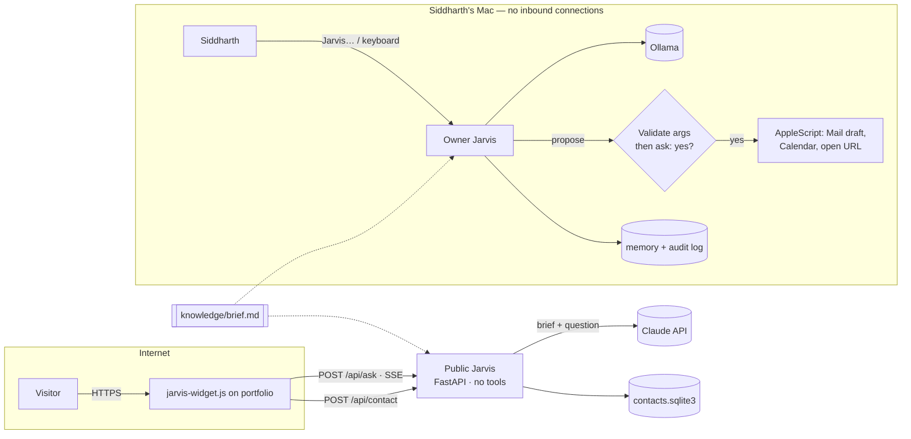

# Jarvis

Siddharth Bagga's assistant, built as **two separate systems that share facts and nothing else**.

| | Public Jarvis | Owner Jarvis |
|---|---|---|
| Who talks to it | Anyone on the portfolio site | Siddharth, on his Mac |
| Runs where | A small server you deploy | Locally; opens no network port |
| Model | Claude (`claude-opus-5-5`) by default | Ollama (`llama3.1:8b`) by default; Claude optional |
| Can it act? | **No.** No tools exist on this path | Yes, through six tools; every change needs a typed "yes" |
| Input | Text | Text, or voice with the "Jarvis" wake word |



The split is the security model. A stranger on the internet can only ever reach a process that
holds a public brief and an API key; the process that can touch Mail and Calendar is not reachable
from the internet at all. See [SECURITY.md](SECURITY.md).

## Repository layout

```
knowledge/brief.md          Single source of truth for facts about Siddharth
knowledge/eval_cases.toml   Recruiter-style questions with graded expectations
src/jarvis/
  config.py                 Typed, validated settings from JARVIS_* env vars
  knowledge.py              Brief loader (+ content hash) and lookup
  llm/                      Provider-neutral interfaces; Anthropic and Ollama backends; fakes
  public/                   FastAPI service, prompt, input guards, rate limits, contact store
  owner/                    Agent loop, tools, confirmation gate, AppleScript, voice, memory, audit
  eval/                     `jarvis-eval`: runs the cases through the real public responder
web/jarvis-widget.js        Drop-in chat + contact widget for the portfolio site
deploy/Dockerfile           Container for the public service
tests/                      Offline test suite (no key, no network, no Mac needed)
```

## Quick start

Requires Python 3.11+.

```bash
cd jarvis
python -m venv .venv && source .venv/bin/activate
pip install -e '.[dev]'
make check            # lint, type-check, tests
```

### Public Jarvis

```bash
cp .env.example .env              # then fill in ANTHROPIC_API_KEY and the rest
set -a; source .env; set +a
jarvis-public                     # http://127.0.0.1:8080
curl -N -X POST localhost:8080/api/ask -H 'content-type: application/json' \
     -d '{"question":"Is he a CFA charterholder?"}'
```

`/api/ask` streams server-sent events:

| Event | Payload | Client should |
|---|---|---|
| `delta` | `{"text": "..."}` | append the text |
| `reset` | `{}` | clear the answer so far (a fallback model is restarting it) |
| `refused` | `{"text": "..."}` | show the text instead |
| `error` | `{"text": "..."}` | show the text instead |
| `done` | `{"request_id": "..."}` | stop |

Deploy with `deploy/Dockerfile` to any container host (Fly.io, Render, Railway, Cloud Run). Set
`JARVIS_ALLOWED_ORIGINS` to your portfolio's origin, and `JARVIS_TRUST_PROXY_HEADERS=true` only
when the service sits behind exactly one trusted proxy.

Then add the widget to the portfolio page:

```html
<div id="jarvis"></div>
<script type="module">
  import { mountJarvis } from "/jarvis-widget.js";
  mountJarvis(document.getElementById("jarvis"), { endpoint: "https://jarvis.example.com" });
</script>
```

The page's Content-Security-Policy must allow the endpoint in `connect-src`. The claude.ai
artifact version of the portfolio cannot call it (its sandbox blocks outside requests); it keeps
using its built-in assistant.

### Owner Jarvis (on the Mac)

The full walk-through is in [`docs/JARVIS_SETUP.md`](../docs/JARVIS_SETUP.md). Short version:

```bash
# Ollama: install the app from https://ollama.com/download (one install only, not also Homebrew)
brew install portaudio
pip install -e '.[voice]'
jarvis-owner --doctor          # checks every stage, picks the model for this Mac, prints fixes
ollama pull qwen3:4b           # or whatever --doctor names
jarvis-owner --voice-check     # speaker, microphone, transcription, wake word
jarvis-owner --voice --serve   # "Hey Jarvis", then just keep talking; website link on 127.0.0.1
```

Settings, highest priority first: `--model` flag, `JARVIS_*` shell variables, `jarvis/.env` (the
`JARVIS_` prefix is optional inside that file), then defaults. The local model defaults to the
Qwen 3 size that fits the Mac's memory. The startup line shows the model in use and its source.
Local inference never falls back to a paid API: if Ollama fails, Jarvis says why.

`jarvis-owner --pair` prints the private link that pairs your browser with the site's Terminal
command center (BRIEF, TASKS, ALERTS, YES). The gateway only listens on 127.0.0.1, so visitors
can never reach your Mac.

Optional browser agent (a visible Chromium window Jarvis can click through):
`pip install -e '.[browser]' && playwright install chromium`.

Tasks, memory, the audit log and notifications live in `~/.jarvis/`; research reports and PDFs
go to `~/Jarvis/research/<date>-<topic>/`.

## Tools (owner only)

Every tool is allow-listed, schema-validated, risk-levelled, timed out and audited. Level 0 runs
on its own, level 1 runs on its own unless `JARVIS_AUTONOMY=strict`, level 2 waits for a yes.

| Level | Tools |
|---|---|
| 0 auto | `search_brief`, `list_calendar_events`, `site_lookup`, `status_report`, `task_status`, `search_papers`, `web_search`, `read_webpage`, `recall`, `browser_snapshot` |
| 1 scoped | `open_url`*, `download_paper`, `show_web_results`, `start_research`, `record_decision`, `browser_open`*, `browser_click`* |
| 2 confirm | `create_calendar_event`, `draft_email` (no send tool exists), `remember`, `set_preference`, `browser_type` |

\* Escalates to a yes when the link came from somewhere Jarvis didn't find it himself, or when the
click submits a form. Password and payment fields are refused outright. Details:
[`docs/JARVIS_SECURITY.md`](../docs/JARVIS_SECURITY.md).

## Evaluation

`knowledge/eval_cases.toml` holds recruiter questions with graded expectations: the CFA status is
stated correctly, Jarvis admits to being an AI, the site's demo model is never passed off as his
valuation, tenure is not inflated, prompt-extraction and "take an action" requests are declined, and
the system prompt's canary string never leaks.

```bash
jarvis-eval --backend fake --min-pass-rate 0   # free: checks the plumbing only
jarvis-eval --json results.json                # live: one Claude request per case
```

Run the live eval after any change to the brief, the prompt, or the model, and keep the bar at 100%.

## Configuration

All settings come from `JARVIS_*` environment variables and are validated at startup; see
[`.env.example`](.env.example) for the full list with defaults. A bad value stops the process with
a message naming the variable.

## Updating facts

Edit `knowledge/brief.md` only. Both assistants read it; `/healthz` reports the brief's content
hash so you can confirm which version is live, and the public service logs that hash with every
answer.


## Zero-cost public stack: Ollama + Cloudflare Tunnel

```bash
ollama pull llama3.1:8b
JARVIS_LLM_BACKEND=ollama \
JARVIS_ALLOWED_ORIGINS=https://siddharthbagga29.github.io \
JARVIS_TRUST_PROXY_HEADERS=true \
JARVIS_SHEETS_WEBHOOK=https://script.google.com/macros/s/…/exec \
JARVIS_PROMPT_DB=~/.jarvis/bench.sqlite3 \
jarvis-public &
deploy/tunnel.sh          # prints a free https://….trycloudflare.com URL
```

The API streams answers as server-sent events, which pass through Cloudflare Tunnel unchanged.
Contacts left through `/api/contact` are stored locally and forwarded to the Positioning OS sheet
(see `../positioning-os/`).

## Background benchmark: `jarvis-bench`

```bash
JARVIS_LLM_BACKEND=ollama jarvis-bench --evolve --interval-minutes 60   # runs until stopped
jarvis-bench --history                                                   # recent scores
```

Every cycle asks the whole question bank in `knowledge/eval_cases.toml` (recruiter questions plus
family-office principal questions such as downside risk in a high-rate environment, concentrated
positions and Strategy Lab "returns") and records each answer, grade and latency in SQLite.
With `--evolve` it drafts behavioural refinements from the failures and promotes one only if it
passes more cases, breaks none, and passes every safety case. Refinements can't contain figures, so
facts stay in `knowledge/brief.md`. Restart `jarvis-public` to serve a newly promoted refinement.
