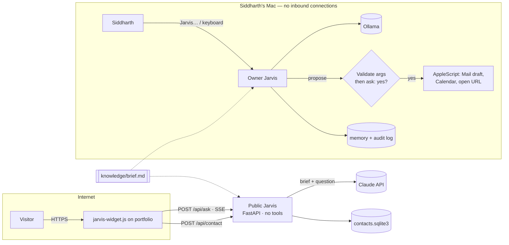

# Jarvis

Siddharth Bagga's assistant, built as **two separate systems that share facts and nothing else**.

| | Public Jarvis | Owner Jarvis |
|---|---|---|
| Who talks to it | Anyone on the portfolio site | Siddharth, on his Mac |
| Runs where | A small server you deploy | Locally; opens no network port |
| Model | Claude (`claude-opus-5-5`) by default | Ollama (`llama3.1:8b`) by default; Claude optional |
| Can it act? | **No.** No tools exist on this path | Yes, through six tools; every change needs a typed "yes" |
| Input | Text | Text, or voice with the "Jarvis" wake word |



The split is the security model. A stranger on the internet can only ever reach a process that
holds a public brief and an API key; the process that can touch Mail and Calendar is not reachable
from the internet at all. See [SECURITY.md](SECURITY.md).

## Repository layout

```
knowledge/brief.md          Single source of truth for facts about Siddharth
knowledge/eval_cases.toml   Recruiter-style questions with graded expectations
src/jarvis/
  config.py                 Typed, validated settings from JARVIS_* env vars
  knowledge.py              Brief loader (+ content hash) and lookup
  llm/                      Provider-neutral interfaces; Anthropic and Ollama backends; fakes
  public/                   FastAPI service, prompt, input guards, rate limits, contact store
  owner/                    Agent loop, tools, confirmation gate, AppleScript, voice, memory, audit
  eval/                     `jarvis-eval`: runs the cases through the real public responder
web/jarvis-widget.js        Drop-in chat + contact widget for the portfolio site
deploy/Dockerfile           Container for the public service
tests/                      Offline test suite (no key, no network, no Mac needed)
```

## Quick start

Requires Python 3.11+.

```bash
cd jarvis
python -m venv .venv && source .venv/bin/activate
pip install -e '.[dev]'
make check            # lint, type-check, tests
```

### Public Jarvis

```bash
cp .env.example .env              # then fill in ANTHROPIC_API_KEY and the rest
set -a; source .env; set +a
jarvis-public                     # http://127.0.0.1:8080
curl -N -X POST localhost:8080/api/ask -H 'content-type: application/json' \
     -d '{"question":"Is he a CFA charterholder?"}'
```

`/api/ask` streams server-sent events:

| Event | Payload | Client should |
|---|---|---|
| `delta` | `{"text": "..."}` | append the text |
| `reset` | `{}` | clear the answer so far (a fallback model is restarting it) |
| `refused` | `{"text": "..."}` | show the text instead |
| `error` | `{"text": "..."}` | show the text instead |
| `done` | `{"request_id": "..."}` | stop |

Deploy with `deploy/Dockerfile` to any container host (Fly.io, Render, Railway, Cloud Run). Set
`JARVIS_ALLOWED_ORIGINS` to your portfolio's origin, and `JARVIS_TRUST_PROXY_HEADERS=true` only
when the service sits behind exactly one trusted proxy.

Then add the widget to the portfolio page:

```html
<div id="jarvis"></div>
<script type="module">
  import { mountJarvis } from "/jarvis-widget.js";
  mountJarvis(document.getElementById("jarvis"), { endpoint: "https://jarvis.example.com" });
</script>
```

The page's Content-Security-Policy must allow the endpoint in `connect-src`. The claude.ai
artifact version of the portfolio cannot call it (its sandbox blocks outside requests); it keeps
using its built-in assistant.

### Owner Jarvis (on the Mac)

```bash
brew install ollama && ollama serve &      # or the Ollama app
ollama pull llama3.1:8b                    # tool-capable; plain llama3 cannot call tools
pip install -e .
jarvis-owner                               # keyboard mode
jarvis-owner --dry-run                     # every action is shown and declined
```

Voice mode adds the wake word and local speech recognition:

```bash
brew install portaudio
pip install -e '.[voice]'
export JARVIS_PICOVOICE_ACCESS_KEY=...     # free key from console.picovoice.ai
jarvis-owner --voice                       # say "Jarvis", then your request
```

macOS asks the first time Jarvis controls Mail or Calendar and the first time it uses the
microphone; allow it for your terminal app. Notes, the audit log and memory live in `~/.jarvis/`.

To use Claude instead of a local model: `JARVIS_LLM_BACKEND=anthropic jarvis-owner`.

## Tools (owner only)

| Tool | Changes anything? | Notes |
|---|---|---|
| `search_brief` | no | Line lookup in the brief |
| `list_calendar_events` | no | Next 1–14 days |
| `create_calendar_event` | **yes — confirm** | Date, time and duration validated locally |
| `draft_email` | **yes — confirm** | Opens a draft in Mail. There is no send tool |
| `open_url` | **yes — confirm** | `https://` only |
| `remember` | **yes — confirm** | Notes feed future prompts, so they are gated too |

## Evaluation

`knowledge/eval_cases.toml` holds recruiter questions with graded expectations: the CFA status is
stated correctly, Jarvis admits to being an AI, the site's demo model is never passed off as his
valuation, tenure is not inflated, prompt-extraction and "take an action" requests are declined, and
the system prompt's canary string never leaks.

```bash
jarvis-eval --backend fake --min-pass-rate 0   # free: checks the plumbing only
jarvis-eval --json results.json                # live: one Claude request per case
```

Run the live eval after any change to the brief, the prompt, or the model, and keep the bar at 100%.

## Configuration

All settings come from `JARVIS_*` environment variables and are validated at startup; see
[`.env.example`](.env.example) for the full list with defaults. A bad value stops the process with
a message naming the variable.

## Updating facts

Edit `knowledge/brief.md` only. Both assistants read it; `/healthz` reports the brief's content
hash so you can confirm which version is live, and the public service logs that hash with every
answer.
